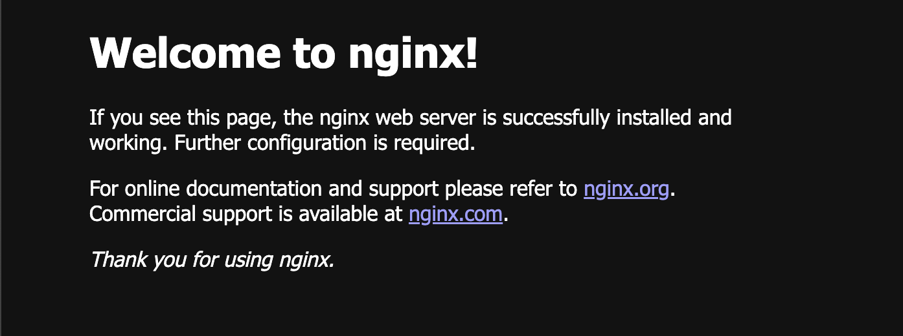
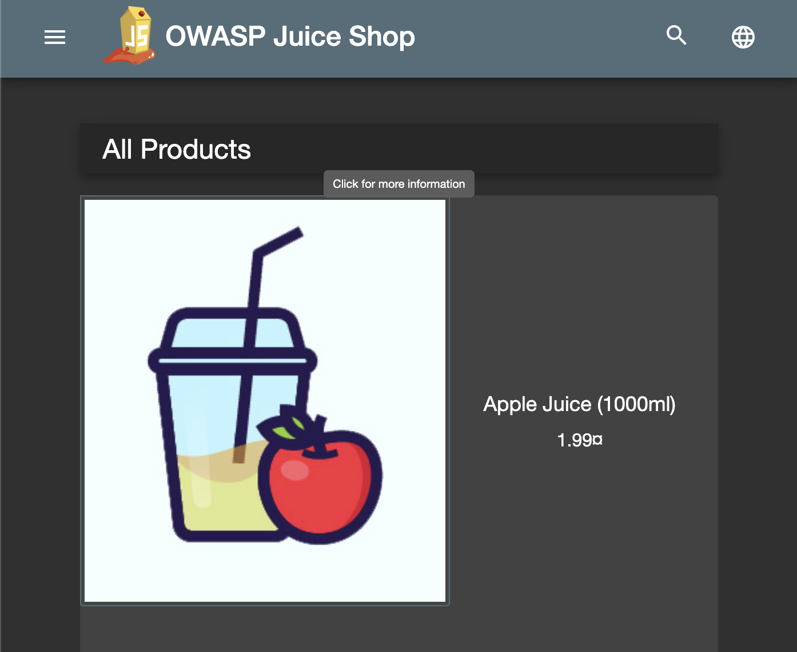

# Building a CD Pipline Using Kubernetes

Within this repo, I'm using Terraform, Linode's LKE, and helm in order to build a CD pipeline that's hosted on Kubernetes. I've included screenshots below. Screenshots are also links for your convenience.

Though this is simplate at the moment, it's not finished. More to follow.

## Available Services

Progress: [Completed (Part 7): Managing Stacks with Helm](https://www.linode.com/docs/guides/build-a-cd-pipeline-with-lke-part-7/)

Reference: [Building a CD Pipeline Using LKE, Helm, and GitLab](https://www.linode.com/docs/guides/build-a-cd-pipeline-with-lke/)